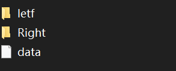
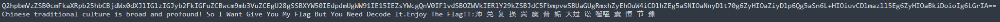
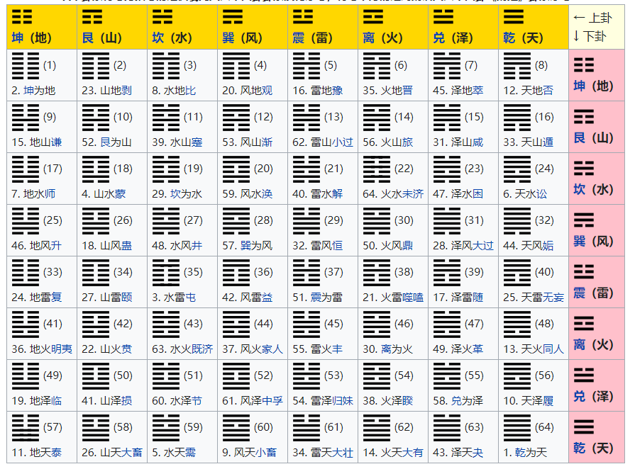
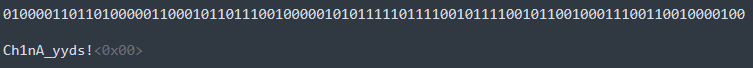

#  This_is_A_tree

附件中的内容是这种形式，每个目录里面都会包含一个data文件和两个子目录，显然是一个二叉树。



前序遍历目录并把文件内容拼接起来，发现是一个BASE64编码，解码之后得到若干汉字：



查了一下发现这是六十四卦的内容。



把对应的卦用二进制来表示，例如“师”就是010000。将这些二进制拼接为一个字符串，再将每8位转换为字符，得到flag：



EXP：
```python
import os
import base64

def preorder(path):
    left = path + '/letf'
    right = path + '/Right'
    with open(path+'/data') as f:
        content = f.read()
    if os.path.exists(left):
        content += preorder(left)
    if os.path.exists(right):
        content += preorder(right)
    return content

content = preorder('.')
print(content)
print(base64.b64decode(content).decode())
print()

arr = ['010000', '110110', '100000', '110001', '011011', '100100', '000101', '011111', '011110', '010111', '100101', '100100', '011100', '110010', '000100']

s = ''.join(arr)
print(s)
for i in range(0, len(s), 8):
    print(chr(eval('0b'+s[i:i+8])), end='')
print()
```
